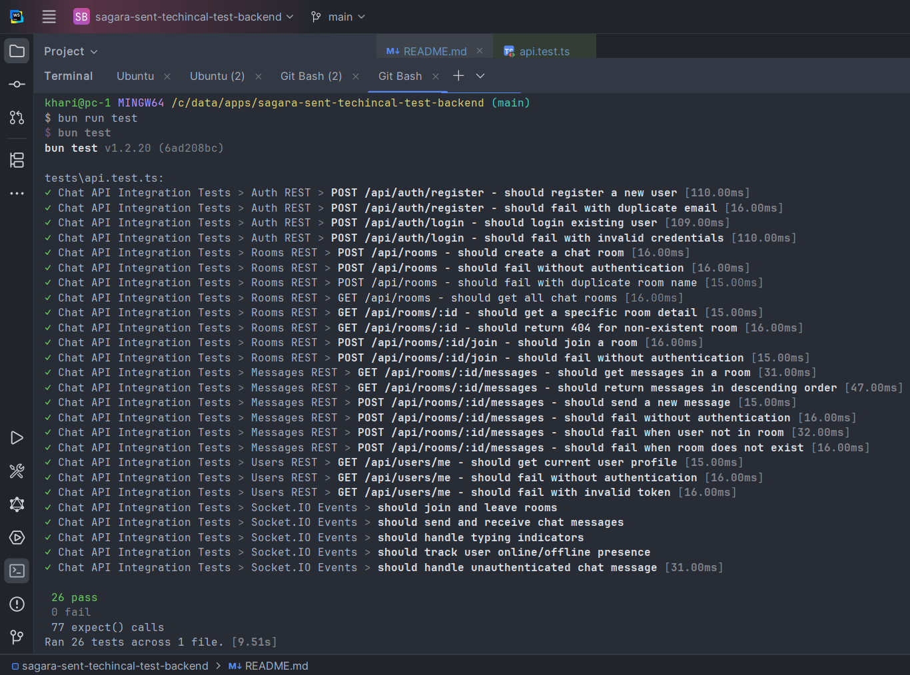

# sagara-sent-technical-test-backend

## Specification
> https://gist.github.com/arigi-sent/2a240acafd9964a529108e1d08d350f5

## How to Use

### Without docker (recommended).
- Set up a `.env` file with the necessary environment variables (e.g., App Port, MongoDB URI, JWT secret).
- Run MongoDB locally with `docker compose up -d datastore-1` or use a cloud MongoDB service.
- Run `bun install` to install dependencies.
- Run `bun run test` to execute tests.
- Run `bun run start` to start the development server.

### Using docker.
- Set up a `.env` file with the necessary environment variables (e.g., App Port, MongoDB URI, JWT secret).
- Use `docker-compose up -d` to start the App and MongoDB services.

## Completion Proof
